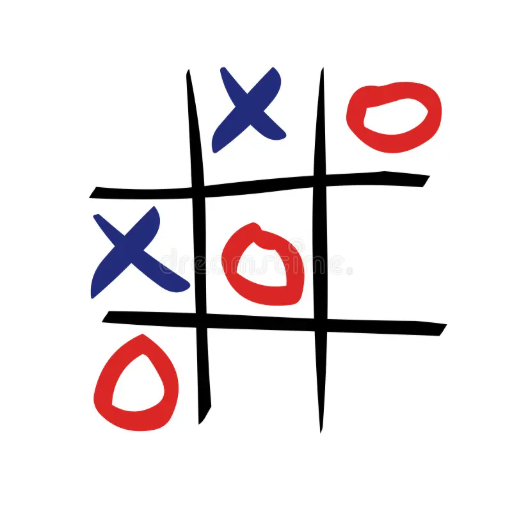
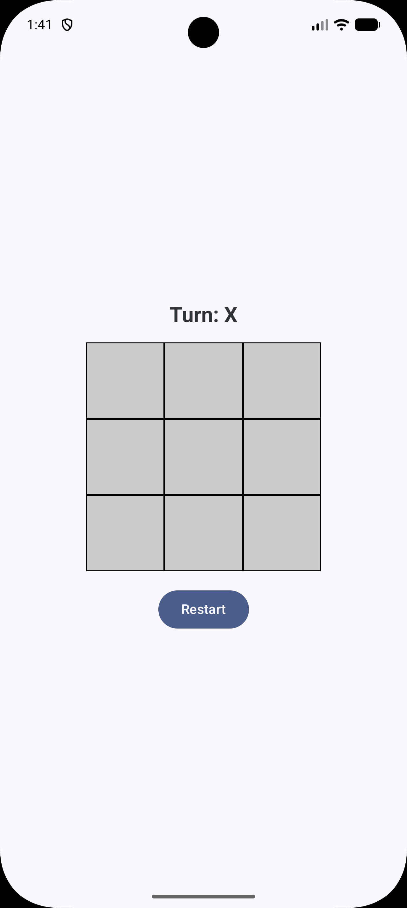
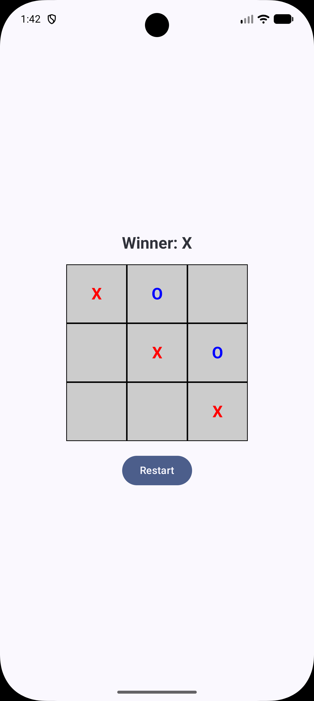
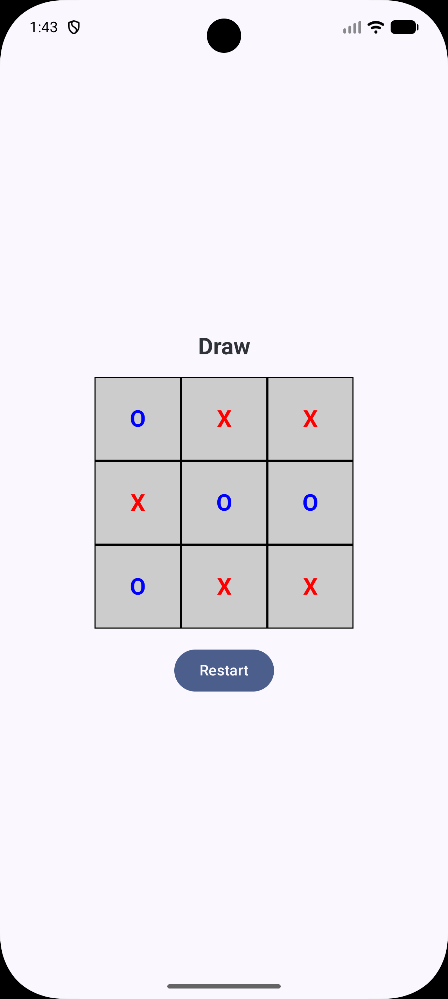

# Tic Tac Toe – Jetpack Compose
A clean, test-driven implementation of the classic Tic Tac Toe game, built with Kotlin and Jetpack Compose, following Clean Architecture principles.

## 🚀 Getting Started

### Prerequisites
* Android Studio Iguana | 2023.2.1 or later
* Android SDK 34 or later

### Installation
1. Clone the repository: git clone https://github.com/2026-DEV23-1993/TicTacToe-Android.git
2. Open the project in Android Studio
3. Sync Gradle
4. Run the app

## 📸 Screenshots

|         Gameplay          |      Winning State       |           Draw            |
|:-------------------------:|:------------------------:|:-------------------------:|
|  |  |  |

## ✨ Features
* Classic 3×3 Tic Tac Toe gameplay
* X always starts first
* Real-time turn indication
* Winning line detection and highlight
* Draw detection
* Restart game support
* Fully unit-tested game logic

## 📜 Game Rules
The game follows standard Tic Tac Toe rules:

1. X always goes first
2. Players alternate turns
3. A move cannot be played on an occupied cell
4. A player wins by placing three symbols in a row:
    * Horizontally
    * Vertically
    * Diagonally
5. If all nine cells are filled without a winner, the game ends in a draw

### Covered scenarios:

* X always starts first
* Player turns alternate correctly
* Invalid moves are rejected
* Win detection (rows, columns, diagonals)
* Draw detection
* No moves allowed after game completion

## 🧱 Architecture Overview

The project follows Clean Architecture, separating responsibilities into clear layers.
        
        +---------------------+
        |     UI Layer        |
        |  Jetpack Compose    |
        +---------------------+
                   |
               UiEvents
                   |
                   v
        +---------------------+
        |  ViewModel Layer    |
        |   State & Logic     |
        +---------------------+
                   |
               Use Cases
                   |
                   v
        +---------------------+
        |    Domain Layer     |
        |   Business Rules    |
        +---------------------+
        
## Key points:

* All game rules live in the Domain layer
* Domain logic is pure Kotlin, with zero Android dependencies
* ViewModel and UI rely exclusively on tested domain behavior

## Why Clean Architecture?

* Keeps business logic independent of UI and framework
* Improves testability
* Enhances maintainability and scalability
* Allows UI or framework changes without affecting core rules

## 🗂️ Project Structure

    app/
    ├── ui/
    │   ├── TicTacToeScreen.kt
    │   ├── components/
    │   └── theme/
    │
    ├── viewmodels/
    │   ├── TicTacToeViewModel.kt
    │   ├── models/
    │   └── utils/
    │
    ├── domain/
    │   ├── models/
    │   │   ├── TicTacToeGameState.kt
    │   │   └── TicTacToeSymbol.kt
    │   └── usecases/
    │       └── GetCurrentGameState.kt
    │
    └── test/
        └── domain/
        └── viewmodels/

## 🔄 State Management & Data Flow

The app uses unidirectional data flow, aligned with Google’s recommended architecture.

    UI (Compose) sends UiEvent
                |
                v
    ViewModel executes Use Case
                |
                v
    Domain Logic returns new State
                |
                v
    ViewModel updates its StateFlow
                |
                v
    UI recomposes based on new State
